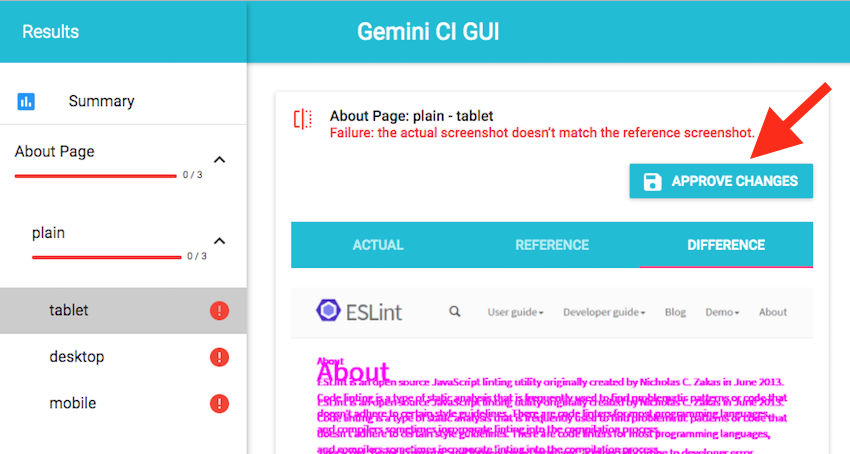

[](https://travis-ci.org/holidaycheck/gemini-ci-gui)
[](https://david-dm.org/holidaycheck/gemini-ci-gui)

# gemini-ci-gui

CI GUI for [Gemini](https://gemini-testing.github.io/).

The `gemini-ci-gui` is meant to work with an already existing test report. Most commonly the report will be created by a CI/CD pipeline, but `gemini-ci-gui` doesn’t really care about how the report is generated.

Reports must be generated with the [`gemini-json-reporter` plugin](https://github.com/holidaycheck/gemini-json-reporter).

Main features are:

* viewing an existing test report
* approving certain test failures
* adding new reference images

In order to approve failures or to add reference images `gemini-ci-gui` needs write access to the report file and to the reference images.

## How does it look like?

After the first run of a specific test a reference image doesn’t exist (unless you ran `gemini update` before).
In this case you will see an `Accept as Reference` button.


When the button is clicked the test will be marked as `success` immediately. The report file will be modified accordingly and the reference image will be created.


When a test fails due to visual changes the GUI will show you the actual image, the reference image and the diff image. If you think the changes are intentionally you can click the `approve` button which will mark the test as `success` and update the report and reference image.



## How to run?

In order to run `gemini-ci-gui` you must specify the path to the report file via the environment variable `REPORT_FILE`.

```
   $ REPORT_FILE=/path/to/my/report.json npm start
```

You can then open the GUI on `http://localhost:3000`.

-------

PS: This project definitely needs a better name. Please let me know if you have any suggestions.

## FAQ

### There is already `gemini-gui`, why do we need another one?

`gemini-gui` follows a different approach. It instruments the `gemini` runner in order to execute test runs and update tasks directly from the GUI without persisting any state. So if you reload the page your test report is gone.
Currently this project is a proof-of-concept, maybe its features will be included in `gemini-gui` directly sometime in the future, have a look at this [issue](https://github.com/gemini-testing/gemini-gui/issues/63) for an ongoing discussion.
